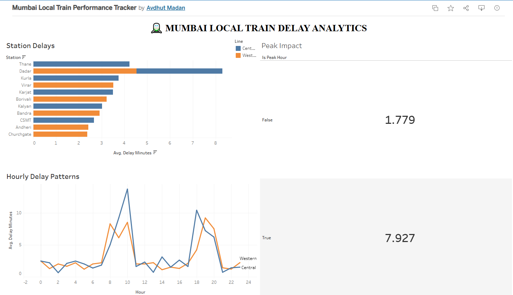

# 🚆 Mumbai Local Train Performance & Delay Tracker

An end-to-end data analytics project examining operational delays across Mumbai's Western and Central railway lines. This project processes simulated domain-informed train data using Pandas, engineers custom temporal features, and delivers interactive analytics via a live Tableau Public dashboard.

---

## 📊 Live Interactive Dashboard
👉 **[View Live Interactive Dashboard on Tableau Public](https://public.tableau.com/app/profile/avdhut.madan/viz/MumbaiLocalTrainPerformanceTracker/Dashboard1?publish=yes)**

---

## 💡 Key Analytical Insights
- **Rush Hour Impact:** Delays jump over **4x during peak hours** (7.93 minutes average delay) compared to non-peak off-hours (1.78 minutes average delay).
- **Bottleneck Stations:** **Dadar (Western Line)** recorded the highest average delay across the network at **4.53 minutes**, closely followed by **Thane (Central Line)** at **4.23 minutes**.
- **Time-of-Day Trends:** Network-wide delays peak sharply at **10:00 AM** and **7:00 PM**, matching commuter backlog patterns.
- **Service Performance:** **73.8%** of analyzed trips ran on-time or with minor delays ($\le 3$ mins), while **7.4%** suffered severe disruptions ($> 10$ mins).

---

## 🛠️ Tech Stack & Workflow
- **Data Manipulation:** Python (`pandas`, `numpy`)
- **Data Pipeline:** Standardized column data types, extracted `Hour` features, engineered binary `Is_Peak_Hour` indicators, and categorized delay severity levels.
- **Visualization:** Tableau Public (Interactive parameters, filter actions, custom layout cards).

---

## 📂 Repository Structure
├── mumbai_train_delays_cleaned.csv   # Processed dataset
├── train_analysis.ipynb              # Pandas feature engineering notebook
├── dashboard_preview.PNG             # Preview screenshot of Tableau dashboard
└── README.md                         # Project documentation
